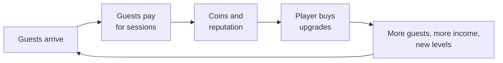

# Surf Tycoon — Game Concept Document

2026-09-21 · @Someone

## Concept overview

Surf Tycoon is a mobile idle tycoon game about running a water-sports spot, modelled on the mobile game "Idle Theme Park - Tycoon Game".

Where the reference game is set in a theme park, this one is set on a beach and in the sea. Guests are surfers and other water-sport athletes instead of park visitors.

The author is a water-sports enthusiast. The first version keeps things simple: all sports can always be played, and there is no time or weather system yet.

This document only records the idea so that someone else can understand it exactly. The last sections describe a way it could be built. Sections marked (proposal) are suggestions added on top of the author's idea.

## Water sport disciplines

The game covers six water sports, each of which works as its own level or track:

1. Wave surfing
2. Kitesurfing
3. Windsurfing
4. Foil and wing
5. Sailing
6. Skimboarding

Wave surfing is the worked example in this document. Every other discipline follows the same structure of four levels, each with a zone, its guests and its conditions.

## Map layout

The map is 20% beach and 80% sea.

| Area | Share of map | Look |
| --- | --- | --- |
| Beach | 20% | Sand, the land side of the spot |
| Sea | 80% | Light blue near the shore, getting darker blue further out |

The colour gradient in the sea gives a sense of depth. It also fits the sea zones described below, where the water further out is for more advanced surfers.

## Areas of the map

The map has three areas: Wave, Sea and Ocean. The author chose this over one huge map and over a separate place for every sport. Water sports people like to hang out together, so windsurfing, kitesurfing and foiling should not each get their own place.

| Area | Sports | Water |
| --- | --- | --- |
| Wave | Wave surfing, skimboarding | Small waves up to really big waves |
| Sea | Kitesurfing, windsurfing, foil and wing | Normal, open sea |
| Ocean | Sailing, boats and more | Big, open ocean |

Each area can hold several zones. In the Wave area the zones are the wave surfing levels: a small starter wave, a small to medium wave, the reef with big waves, and Nazaré with really big waves.

### One big map

The author prefers one big map over separate worlds. The map is a square of 10 by 10 units. A phone screen is 1 unit wide and 2 units high. The whole map is rotated by 35 degrees, which makes it a fun way to look at it. The player swipes freely all over the map, and all areas are on it.

The map should also look good. Each important zone gets a landmark that makes it recognisable (see Look and landmarks).

### Layout sketch (proposal)

This part is a suggestion. The 20% beach becomes the first two rows of the 10 by 10 grid, and the 80% sea becomes the other eight rows, getting darker further from the beach.

| Rows | Part of the map | What is there |
| --- | --- | --- |
| 1 to 2 | Beach | The shared hangout and its buildings, with rocks at the skimboarding spot |
| 3 to 5 | Wave area | Light blue water and the wave surfing zones, from the small starter wave to the reef and Nazaré |
| 6 to 8 | Sea area | Normal blue water for windsurfing, kitesurfing and foil and wing |
| 9 to 10 | Ocean area | Dark blue, open water for sailing and boats |

### Making the big map work (proposal)

- **Zoom and overview.** With a 1 by 2 view on a 10 by 10 map, the phone sees only about 2% of the map. Pinch-to-zoom and a small overview map with a jump button per area save the player from long swiping.
- **Fill the corners.** Rotating the map leaves empty corners on the screen. Continue the open sea past the map edges so the corners never show empty space.
- **Fog on locked areas.** Areas the player has not unlocked sit under a light haze. The player sees the whole map from the start, and each area clears when it opens.
- **One shared beach.** The beach spans the front of the map, so every area is reached from the same hangout.

## Look and landmarks

The author wants the map to look nice, with a landmark that makes each important zone recognisable. These three come from the author's reference photos.

| Zone | Landmark | Look |
| --- | --- | --- |
| Skimboarding spot | Rocks | A sandy cove with large rocks, a rock arch and cliffs, and shallow, clear water |
| Reef (wave surfing level 3) | Coral reef | A colourful reef in turquoise shallows, with a long, clean wave breaking along its edge and deep blue water behind |
| Nazaré (wave surfing level 4) | The red tower | The red lighthouse on the stone fort at the cliff edge, with huge waves crashing below it |

The first two wave surfing levels, the Sea area and the Ocean area do not have a landmark yet.

## Sea zones and skill levels

The sea is divided into different sections, and each section serves a higher skill level than the one before it. Wave surfing is the worked example, with four levels starting at the front of the sea.

| Level | Zone | Who surfs there | Conditions and notes |
| --- | --- | --- | --- |
| 1 | Beginner class | Kids in a class, wearing bright vests | Small, long, rolling waves |
| 2 | Longboarders | Longboard surfers | Small, long, rolling waves |
| 3 | Reef | Good surfers | High waves |
| 4 | Nazaré | Pros only | Big waves |

Level 4 is named after Nazaré, the Portuguese spot known for giant waves.

## The other five sports (proposal)

Every other sport gets the same overview as wave surfing: four levels, each with its own zone, its own guests and its own conditions. The zones and guests are suggestions. The conditions are fixed features of each zone, so all sports can always be played and nothing is random.

### Skimboarding

| Level | Zone | Who skims there | Conditions and notes |
| --- | --- | --- | --- |
| 1 | Shallows | Kids and first-timers | Ankle-deep water at the water's edge, no waves |
| 2 | Flatland | Flatland riders | Wide, flat, wet sand with a thin layer of water |
| 3 | Shore break | Wave riders | Small, steep waves breaking close to the sand |
| 4 | Big shore break | Pros only | Big, fast waves breaking right on the sand |

### Windsurfing

| Level | Zone | Who windsurfs there | Conditions and notes |
| --- | --- | --- | --- |
| 1 | Beginner class | Kids and adults in a class, on wide, stable boards | Shallow, flat water and light, steady wind |
| 2 | Freeride | Windsurfers cruising back and forth | Steady wind and flat to slightly choppy water |
| 3 | Speed and freestyle | Fast riders and trick riders | Strong wind and choppy water |
| 4 | Wave zone | Pros only | Strong wind and big waves |

### Kitesurfing

Kitesurfing needs its own wide launch area on the beach, so the beach side of the map is part of this sport.

| Level | Zone | Who kitesurfs there | Conditions and notes |
| --- | --- | --- | --- |
| 1 | Kite school | Beginners in a class, starting with a small trainer kite | Shallow, flat water and steady wind |
| 2 | Freeride | Riders on twin-tip boards | Steady wind and flat to slightly choppy water |
| 3 | Freestyle and big air | Riders who do tricks and big jumps | Strong wind and choppy water, with lots of open space |
| 4 | Big air and waves | Pros only | Very strong wind and big waves |

### Sailing

Sailing needs boats and a jetty on the beach side, so it is a bigger investment than the sports before it.

| Level | Zone | Who sails there | Conditions and notes |
| --- | --- | --- | --- |
| 1 | Sailing school | Kids in a class, in small dinghies | Sheltered, flat water and light wind |
| 2 | Boat hire | Weekend sailors in dinghies and catamarans | Open water near the shore and steady wind |
| 3 | Club racing | Racing sailors on faster boats | Open water, strong wind and a marked race course |
| 4 | Offshore regatta | Pro crews -volvo ocean race idea | Open sea, strong wind and big swell |

### Foil and wing

Foiling means riding on a hydrofoil, a wing under the board that lifts it above the water. A wing is a hand-held inflatable wing that catches the wind.

| Level | Zone | Who foils there | Conditions and notes |
| --- | --- | --- | --- |
| 1 | Foil school | Beginners in a class, on big, stable foil boards | Flat, calm water |
| 2 | Wing freeride | Riders with a hand-held wing | Light wind and flat water |
| 3 | Downwind | Experienced riders who ride small ocean swells | Open water with long, rolling swell |
| 4 | Pro arena | Pros only | Big waves and strong wind |

## Idle loop and upgrades (proposal)

This section is a suggestion added on top of the author's idea. In an idle tycoon, progress comes from spending income on upgrades that make the spot earn more, even while the player is away.

The game has two currencies. Coins come from guests and are spent on upgrades. Reputation comes from happy guests and events, and it gates the higher levels and new disciplines.

| Upgrade | What it does | Example in wave surfing |
| --- | --- | --- |
| Capacity | More guests fit in a zone at once | A bigger beginner class, more surfers on the reef |
| Income per guest | Each guest pays more | Lesson price, board rental |
| Speed | Guests finish sessions faster, so more guests per hour | Faster turnover between classes |
| Automation | A hired manager runs a zone while the player is away | A head instructor for the beginner class |
| Beach facilities | Shared buildings on the 20% beach that boost every discipline | Rental shop, café, showers, lifeguard tower |

Each purchase costs more than the last one. The exact numbers are for balancing later. A zone without a manager waits until the player returns, so buying automation is the first big step toward real idle play.

## Starting with wave surfing (proposal)

The player starts with an empty beach and only Level 1 of wave surfing, the beginner class. Each further level is a purchase with its own goal.

| Level | What the player buys first | What unlocks it |
| --- | --- | --- |
| 1. Beginner class | Bright vests, a first instructor, a board rack | Available from the start |
| 2. Longboarders | Longboard rental, a beach café | Level 1 upgraded to a set point, plus coins |
| 3. Reef | Lifeguard tower, reef access | Enough reputation, plus coins |
| 4. Nazaré | Rescue jet ski, a safety crew | High reputation, plus coins |

Every level also uses the shared upgrade types above, so the player keeps growing the same zone while saving for the next one.

When Level 2 is owned, the next discipline unlocks and the player has more than one thing to grow. The order is described next.

## Unlock order of the disciplines (proposal)

The sports unlock one at a time and follow the three areas: first the Wave area, then the Sea area, then the Ocean area. Within an area the cheaper sport comes first. Once a sport is unlocked it can always be played.

| Order | Sport | Area | Why it comes here |
| --- | --- | --- | --- |
| 1 | Wave surfing | Wave | The starting point |
| 2 | Skimboarding | Wave | Cheap, needs only the beach and the shallows |
| 3 | Windsurfing | Sea | The first sport with sails and bigger equipment, and it opens the Sea area |
| 4 | Kitesurfing | Sea | Needs its own launch area on the beach |
| 5 | Foil and wing | Sea | The most technical gear in the Sea area |
| 6 | Sailing | Ocean | Needs boats and a jetty, the biggest investment, and it opens the Ocean area |

The rule: the next discipline unlocks when the player owns Level 2 of the previous one and has enough reputation. That way several disciplines grow in parallel and the player always has something to buy.

## How to build it (proposal)

This section is a suggestion, checked on 21 September 2026. All the main routes are free for a game like this. The web route is the one where Claude can do the most on its own.

Start by saving a copy of this document in the project folder and pointing the project's CLAUDE.md file at it. Claude Code reads that file at the start of every session, so each session begins from the author's exact idea.

### The options

| Route | Cost | How much Claude can do | Fit for this game |
| --- | --- | --- | --- |
| Web: Phaser 4 with TypeScript | Free, MIT licence | Almost everything. The game is text files, so Claude can write, run and fix it | Best fit: 2D, very large tile maps, works on phones |
| Godot | Free, MIT licence, no royalties | Scenes and scripts are text files that Claude edits directly. Unofficial add-ons can also drive the open editor | Good fit for 2D, needs the Godot editor installed |
| Unity | Free Personal plan below $200,000 of revenue and funding in 12 months | Official Unity Plugin for Claude Code, with live Editor control | Good fit, but the heaviest set-up |
| Unreal Engine | Free until $1 million lifetime revenue, then a 5% royalty | Not researched | Too big for a 2D idle game |

The official Unity plugin came out on 9 September 2026. Whether its live Editor connection needs a paid Unity plan was not checked. A web game can be wrapped into iPhone and Android apps later with a tool such as Capacitor.

### What Claude can do, and what the author still does

Claude can write nearly all the code, set up the project, run it and fix the errors. On the web route this needs no game editor at all. The author still does four things:

- **Play and give feedback.** Only a player can judge how the game feels.
- **Provide the art.** The isometric tiles, the rocks, the reef and the red tower need free asset packs, an artist, or simple vector art that Claude can draw.
- **Test on a real phone.**
- **Create the store accounts and press publish.**

### What it costs

- **Claude Code** is included with the Claude Pro and Max plans. Its usage counts against the same limits as chat. For larger projects, the plan page suggests moving up to Max 5x if the limit keeps being hit.
- **Web release:** no store fee.
- **Google Play:** a one-time registration fee of US$25.
- **Apple App Store:** the Apple Developer Program costs $99 a year.

### Suggested build order

| Step | What Claude builds | What the author checks |
| --- | --- | --- |
| 1 | The empty map: a 10 by 10 grid, rotated 35 degrees, with swiping and zoom | Does the map feel good to move around? |
| 2 | The idle loop: coins, the first wave surfing zone, upgrades, and earnings while away | Is buying the first upgrades fun? |
| 3 | The rest of the wave surfing levels, with the reef and the red tower | Does it look like the reference photos? |
| 4 | Reputation, skimboarding with its rocks, and the unlocks for the other sports and areas | Does the progression feel right? |
| 5 | Art, sound and polish | Does it look good? |
| 6 | The phone build and the store release | Does it work on a real phone? |

### Sources

All pages were opened and read on 21 September 2026.

- [Claude Code overview](https://code.claude.com/docs/en/overview)
- [Use Claude Code with your Pro or Max plan](https://support.claude.com/en/articles/11145838-use-claude-code-with-your-pro-or-max-plan)
- [Official Unity Plugin for Claude Code](https://unity.com/blog/unity-plugin-for-claude-code)
- [Unity Personal](https://unity.com/products/unity-personal)
- [Unreal Engine licensing](https://www.unrealengine.com/license)
- [Godot Engine license](https://godotengine.org/license/)
- [godot-mcp, an unofficial Godot add-on for Claude](https://github.com/YasiruRF/godot-mcp)
- [Phaser](https://github.com/phaserjs/phaser)
- [Capacitor](https://capacitorjs.com/docs)
- [Google Play Console registration](https://support.google.com/googleplay/android-developer/answer/6112435)
- [Apple Developer Program](https://developer.apple.com/programs/)

## Parked for later

The author wants to leave time, weather and events out of the first version to keep it simple. The ideas stay here so they are not lost.

- **Clock and calendar.** A clock and calendar make the day and the week feel real. The beginner class with the kids starts at 10:00 and runs until 14:00, and the good surfers arrive after that.
- **Weather.** Everything in water sports depends on the weather, so the author wants it in the game eventually. For now all sports can always be played and nothing is random.
- **Events.** A competition on the reef every Wednesday for the good surfers, and a Nazaré event several times per month for the pros.

## Open questions

Sections without the word proposal come from the author's idea. These points still need a decision.

- [ ] Do the four wave surfing levels sit at increasing distance from the beach?
- [ ] How much of the map does the player see at once, and can they zoom out?
- [ ] Which landmarks belong to the first two wave surfing levels, the Sea area and the Ocean area?
- [ ] How are windsurfing, kitesurfing and foil and wing laid out inside the Sea area: side by side, or one behind the other?
- [ ] What else belongs in the Ocean area besides sailing? The author wrote "sailing and boats and all".
- [ ] Do the areas and sports unlock one by one as suggested, or is everything available from the start?
- [ ] Do the suggested zones, guests and conditions for the five other sports fit the idea?
- [ ] Should there be a prestige system, where the player restarts with a permanent bonus?
- [ ] Which build route does the author choose: web, Godot or Unity? And is the game only for phones, or also playable in a browser?
- [ ] Where does the art come from: free asset packs, simple vector art drawn by Claude, or an artist?
